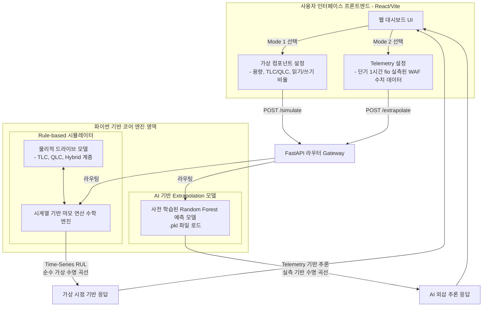
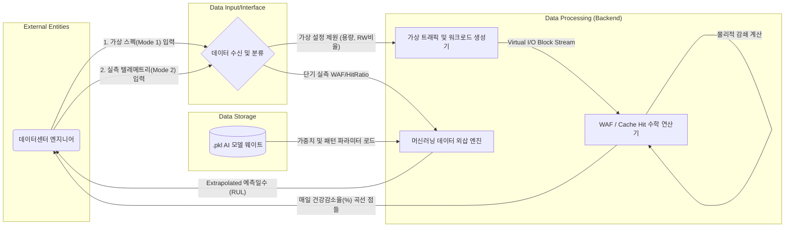
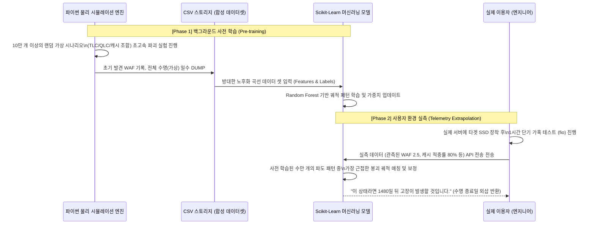

# RedPulse 아키텍처 및 특허 심사용 도면 명세 (Architecture & Flow)

이 문서는 특허 출원 및 논문 작성을 위한 시각적 도면(Flowchart, Architecture Diagram, DFD)을 포함하고 있습니다. 마크다운 기반의 Mermaid 문법으로 작성되어 있어, 손쉽게 이미지 파일로 변환하여 명세서에 첨부할 수 있습니다.

---

## 도면 1. RedPulse 전체 시스템 컴포넌트 구조도 (System Architecture Diagram)

백엔드 엔진과 프론트엔드 대시보드 간의 데이터 흐름, 그리고 Virtual Mode와 Telemetry Mode가 어떻게 상호작용하는지 보여주는 전체 시스템 흐름도입니다.

---

## 도면 2. 시스템 데이터 흐름도 (Data Flow Diagram - DFD)

ML 파이프라인과 순수 가상 엔진으로 입력과 출력이 흐르는 과정에서 데이터가 가공 및 변환되는 논리적 정보의 상호작용 단계들을 보여줍니다.

---

## 도면 3. 하이브리드 SSD 수명 외삽(Extrapolation) 머신러닝 파이프라인 흐름도

이 도면은 특허의 핵심 청구항이 될 **"대규모 가상 공간에서 합성된 노후화 로그와 사용자의 짧은 단기 텔레메트리 값을 결합하여 미래의 잔여 수명을 외삽 추론하는 방법"**을 명확하게 표현합니다.

---

### 도면 해석 및 특허 활용 팁
- **도면 1**은 `발명의 구성` 파트에 적합합니다. 웹 클라이언트부터 게이트웨이를 거쳐 두 가지 엔진(물리, ML)으로 분기되는 아키텍처를 잘 설명합니다.
- **도면 2 (DFD)**는 `데이터 처리 과정도` 파트에 적합합니다. 각 데이터 셋이 사용자로부터 들어와서 어디에 가공되고 어떻게 응답으로 나가는지 데이터의 순수 생애 주기를 보여줍니다.
- **도면 3**은 `발명의 실시예(동작 순서도)` 파트에 핵심으로 들어갑니다. **Phase 1(합성 데이터로 무한 파괴 실험 및 선행 학습)** 단계가 존재한다는 점이 기존 기술과의 차별성을 돋보이게 합니다.
