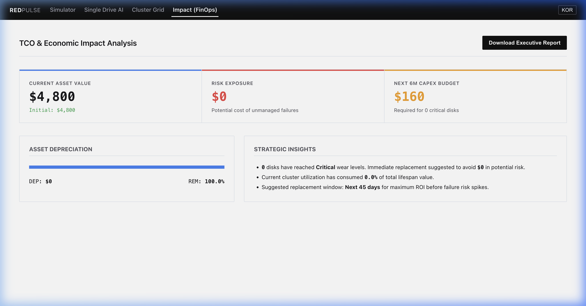
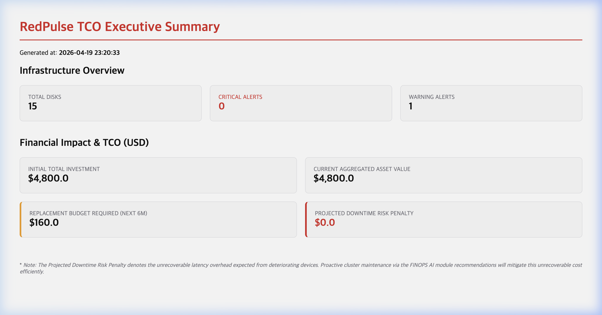

# RedPulse (레드펄스) - AI-Based SSD Lifespan Simulator


RedPulse는 물리적인 자원과 시간을 소비하지 않고, 인공지능(AI)과 가상 시뮬레이션을 통해 다양한 스토리지 구성(TLC, QLC, Hybrid)의 **잔여 수명(RUL, Remaining Useful Life)**을 단 몇 초 만에 예측해내는 웹 기반 대시보드 도구입니다.

## 두 가지 핵심 예측 모드 (Dual Prediction Modes)

RedPulse 시뮬레이터는 사용자의 기획 단계와 검증 단계에 맞춰 가장 효율적인 두 가지 예측 모드를 제공합니다.

### 1. 100% 가상 스펙 시뮬레이션 (PreFlight Mode)
- **개요:** 물리적인 장비 장착 없이 순수 소프트웨어 환경에서 아키텍처를 테스트.
- **용도:** 스토리지 도입 전, "만약 4TB QLC 앞에 100GB SLC로 캐시를 구성한다면?" 이라는 아키텍처 설계와 예산 기획 단계.
- **이점:** 장비 소모액 및 소모 시간 **Zero**. 웹에서 슬라이더만 조절하여 향후 수명 곡선을 즉시 예측.

### 2. 샘플링 실측 기반 AI 추론 (LiveOps Mode)
- **개요:** 실제 서버에 디스크를 장착한 뒤, 몇 시간 이내의 **아주 짧고 강도 높은 초기 테스트**만 진행하여 실제 초기 데이터를 확보.
- **용도:** 짧은 시간 동안 측정된 실제 시스템의 쓰기 증폭(Real WAF) 및 초기 캐시 히트율 등의 실측(Telemetry) 로우 데이터를 AI에 주입.
- **이점:** 실제 하드웨어의 피로마모(Wear-out)는 최소화하면서도, AI가 초기 기울기 패턴을 분석하여 향후 3~5년 간의 전체 수명 곡선을 **가장 높은 신뢰도로 끝까지 시뮬레이션(Extrapolation)** 함.

---

## 주요 워크플로우

- **디바이스 토폴로지 설정**: 순수 고내구성(TLC), 고용량(QLC), 하이브리드(SLC+QLC) 방식 지원.
- **데이터 분석 및 매핑**: (LiveOps 구동 시) 사용자 환경의 실제 서버 텔레메트리 데이터를 수집하여 AI 기반 궤적 보정.
- **다중 노드 클러스터 대시보드**: 수백 대의 노드와 디스크 베이 상태를 한눈에 모니터링하는 엔터프라이즈 모니터링.

---

## 📸 플랫폼 주요 화면 (Screenshots)

### 1. 시뮬레이터 및 실시간 수명 예측 (PreFlight / LiveOps)


### 2. 엔터프라이즈 클러스터 모니터링 (Cluster Grid)


### 3. 특정 노드 및 개별 드라이브 AI 분석 (Node Detail)


### 4. TCO 및 FinOps 리스크 관리 (Impact)


### 5. 자동화된 경영진 리포트 (Executive Report)


---

## 🚀 실행 및 배포 가이드 (Getting Started)

### 1. 중앙 대시보드 서버 통합 실행 (Docker)
Docker Compose를 사용하여 백엔드와 프론트엔드를 한 번에 실행할 수 있습니다.

```bash
docker-compose up --build
```
- **웹 대시보드**: `http://localhost:5173`
- **백엔드 API**: `http://localhost:8000`

### 2. 스토리지 노드 에이전트 배포 (CLI Agent)
실제 수집이 필요한 각 서버(Linux)에서 에이전트를 데몬 모드로 실행하여 데이터를 중앙 서버로 보고합니다.

```bash
# 에이전트 60초 주기로 중앙 서버에 보고 시작
./redpulse-cli.py report --node "Node-01" --interval 60
```
- 에이전트는 자동으로 로컬 디스크를 감지하여 상태 정보를 대시보드로 실시간 Push합니다.

---

## 기술 스택 (Tech Stack)
- **Backend**: Python 3, FastAPI, Scikit-Learn (AI Regression / Time-Series Extrapolation)
- **Frontend**: React 18, Vite, Recharts, CSS (Glassmorphism & Dark Mode)

---

### 수동 설치 (Manual Setup)
매뉴얼한 디버깅이나 개발 환경 구동 시 아래 명령어를 참고하세요.

#### 백엔드 (FastAPI)
```bash
cd backend
pip install -r requirements.txt
uvicorn main:app --reload --host 0.0.0.0 --port 8000
```

#### 프론트엔드 (React)
```bash
cd frontend
npm install
npm run dev
```

---

## 디렉토리 구조
```text
redpulse/
├── backend/
│   ├── main.py              # FastAPI 서버 및 API 라우터
│   ├── requirements.txt     # 파이썬 의존성
│   ├── ai/
│   │   └── model.py         # 실측 데이터 구간 기반 향후 예측 AI (Extrapolation) 로직
│   └── simulator/
│       ├── engine.py        # 시계열 물리 기반 가상 수명 엔진 (Virtual Mode)
│       └── storage_models.py# 드라이브 마모 수학적 물리 모델 구성
├── frontend/
│   ├── index.html
│   ├── package.json
│   └── src/
│       ├── App.jsx          # 모드 선택(가상/실측) 및 메인 대시보드 차트
│       └── index.css        # 프리미엄 다크모드 UI
└── README.md
```