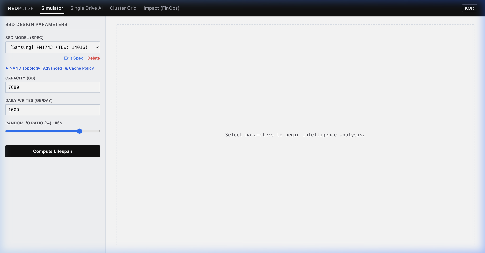
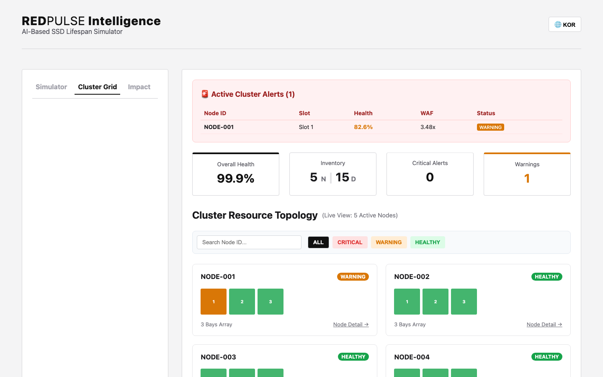
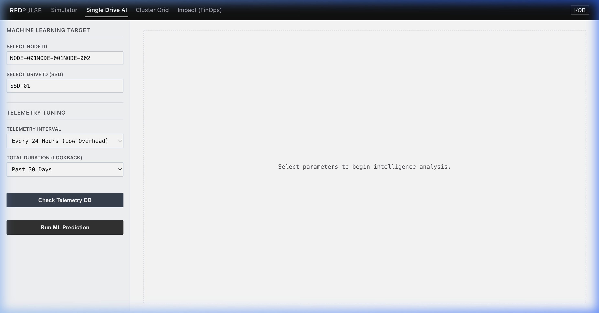

# RedPulse

RedPulse는 SSD 기반 스토리지 인프라의 잔여 수명(RUL, Remaining Useful Life)을 예측하고, 여러 노드의 디스크 상태를 한 화면에서 추적하기 위한 웹 기반 대시보드입니다.

스토리지 엔지니어, 데이터센터 운영자, SRE, 플랫폼 운영 담당자가 다음 질문에 빠르게 답하도록 돕는 것이 목표입니다.

- 지금 설계하려는 TLC, QLC, Hybrid(SLC+QLC) 구성이 특정 워크로드에서 얼마나 버티는가?
- 실제 노드에서 수집된 WAF, 온도, spare 상태를 기준으로 특정 드라이브의 수명 추세는 어떤가?
- 클러스터 안에서 어떤 노드와 디스크가 먼저 확인 대상인가?

RedPulse는 SSD 수명 예측과 운영 관제에 초점을 둔 기술 검증용 도구입니다.

## Demo

<video src="docs/redpulse_demo.mp4" controls width="100%"></video>

[](docs/redpulse_demo.mp4)

[데모 영상 열기](docs/redpulse_demo.mp4)

데모 영상은 현재 구현된 핵심 화면을 순서대로 보여줍니다.

1. PreFlight Simulator: SSD 스펙과 워크로드를 넣어 수명 곡선을 계산합니다.
2. Cluster Grid: 여러 노드와 디스크 베이의 상태를 한눈에 봅니다.
3. Node Detail: 특정 노드의 드라이브 목록과 상태를 확인합니다.

## 핵심 기능

### 1. PreFlight SSD 수명 시뮬레이션

물리 장비를 장시간 소모하지 않고 SSD 구성과 워크로드 조건을 바꿔가며 예상 수명 곡선을 계산합니다.

- TLC, QLC, Hybrid(SLC+QLC) 토폴로지 선택
- 상용 SSD 모델 스펙 기반 시뮬레이션
- 커스텀 TBW, 용량, 일일 쓰기량, 랜덤 I/O 비율 입력
- Write-back / Write-through 캐시 정책 비교
- 결과: 예상 수명, 평균 WAF, 캐시 히트율, health curve

### 2. Single Drive AI 예측

실제 텔레메트리 DB에 쌓인 노드/드라이브 데이터를 선택해 단일 SSD의 잔여 수명을 예측합니다.

- 노드 선택 후 해당 노드의 드라이브 선택
- lookback 기간과 수집 간격 설정
- LSTM 기반 시계열 추론과 방어적 fallback 로직
- 결과: 예상 수명, 95% 신뢰구간, 수명 곡선

### 3. Cluster Grid 관제

다중 노드 환경에서 어떤 노드와 디스크가 우선 확인 대상인지 빠르게 파악합니다.

- 전체 노드/디스크 상태 요약
- Critical / Warning / Healthy 필터
- 노드 검색
- 노드 상세 drawer
- 특정 노드에서 Single Drive AI 분석 화면으로 이동

### 4. Telemetry Agent / CLI

운영 노드 또는 데모 환경에서 디스크 텔레메트리를 백엔드로 전송합니다.

- mock 디스크 상태 전송
- 노드명과 여러 드라이브 ID 자동 포함
- 수집 항목: WAF, temperature, PE cycles, available spare, throughput, IOPS

## 대표 사용 시나리오

### 시나리오 A: 도입 전 스토리지 구성 검증

1. Simulator 탭에서 SSD 모델을 선택합니다.
2. 일일 쓰기량과 랜덤 I/O 비율을 입력합니다.
3. TLC, QLC, Hybrid 구성을 바꿔가며 예상 수명 곡선을 비교합니다.
4. 특정 워크로드에서 QLC 단독 구성이 충분한지, Hybrid cache가 필요한지 판단합니다.

### 시나리오 B: 실제 노드 텔레메트리 기반 분석

1. 에이전트 또는 CLI가 노드별 디스크 상태를 `/api/v1/telemetry/ingest`로 전송합니다.
2. Cluster Grid에서 새 노드와 디스크 상태를 확인합니다.
3. 특정 노드의 drawer를 열어 디스크별 health를 확인합니다.
4. Single Drive AI에서 노드와 드라이브를 선택하고 예측을 실행합니다.

### 시나리오 C: 클러스터 상태 점검

1. Cluster Grid를 열어 전체 health, critical, warning 수를 확인합니다.
2. severity 필터로 위험 노드만 좁힙니다.
3. Node Detail에서 어떤 슬롯과 drive ID가 문제인지 확인합니다.
4. 필요한 경우 Single Drive AI로 이동해 수명 추세를 더 자세히 봅니다.

## 빠른 시작

### Docker Compose

```bash
docker-compose up --build
```

- Web UI: `http://localhost:5173`
- Backend API: `http://localhost:8000`

Docker로 실행한 백엔드에 샘플 텔레메트리를 넣으려면:

```bash
REDPULSE_API_BASE=http://localhost:8000 python3 redpulse-cli.py report --node Node-01 --once
```

### Local Development

백엔드:

```bash
python3 -m venv .venv
source .venv/bin/activate
pip install -r backend/requirements.txt
python backend/run_server.py
```

프론트엔드:

```bash
cd frontend
npm install
npm run dev
```

- Web UI: `http://localhost:5173`
- Backend API: `http://localhost:8085`

로컬 백엔드에 샘플 텔레메트리를 한 번 전송하려면:

```bash
python3 redpulse-cli.py report --node Node-01 --once
```

## CLI 예시

지원 SSD 모델 목록:

```bash
python3 redpulse-cli.py ls-models
```

PreFlight 시뮬레이션:

```bash
python3 redpulse-cli.py simulate \
  --model samsung_pm9a3_3_84tb \
  --writes 2000 \
  --random-ratio 80
```

텔레메트리 전송:

```bash
python3 redpulse-cli.py report --node Node-01 --interval 60
```

## API 개요

| Method | Path | Purpose |
| --- | --- | --- |
| `POST` | `/simulate` | SSD 구성과 워크로드 기반 수명 시뮬레이션 |
| `POST` | `/api/v1/telemetry/ingest` | 노드/드라이브 텔레메트리 저장 |
| `GET` | `/api/v1/cluster/stats` | 클러스터 요약 지표 조회 |
| `GET` | `/api/v1/cluster/topology` | 최신 노드/디스크 토폴로지 조회 |
| `GET` | `/api/v1/cluster/node/{node}/drives` | 특정 노드의 드라이브 목록 조회 |
| `GET` | `/api/v1/cluster/node/{node}/history` | 특정 노드/드라이브 히스토리 조회 |
| `GET` | `/api/v1/cluster/node/{node}/predict` | 텔레메트리 기반 단일 드라이브 수명 예측 |
| `GET` | `/api/v1/models` | 상용 SSD 모델 목록 조회 |

## 화면 구성

### PreFlight Simulator


### Cluster Grid



### Node Detail



## 프로젝트 구조

```text
RedPulse/
├── backend/
│   ├── main.py                 # FastAPI routes
│   ├── database.py             # SQLite telemetry storage
│   ├── ai/                     # LSTM / inference facade
│   └── simulator/              # SSD wear simulation models
├── frontend/
│   ├── src/App.jsx             # Main React shell
│   ├── src/components/         # Simulator, cluster, node views
│   └── src/api.js              # API base URL and endpoint map
├── agent/
│   └── agent.py                # Telemetry agent prototype
├── docs/
│   ├── redpulse_demo.mp4       # README demo video
│   └── *.png                   # Product screenshots
└── redpulse-cli.py             # CLI wrapper for demo and telemetry
```

## 현재 구현 범위와 한계

- 실제 Linux SMART/NVMe metric 파싱은 아직 prototype 단계이며, 기본 데모는 mock telemetry를 사용합니다.
- Single Drive AI 예측은 현재 일부 drive profile 값을 고정값으로 사용합니다.
- SQLite 기반 저장소는 데모와 PoC에 적합하며, 장기 운영 환경에서는 별도 time-series DB 검토가 필요합니다.
- 이 저장소의 우선순위는 SSD 수명 예측, 텔레메트리 수집, 클러스터 관제입니다.
